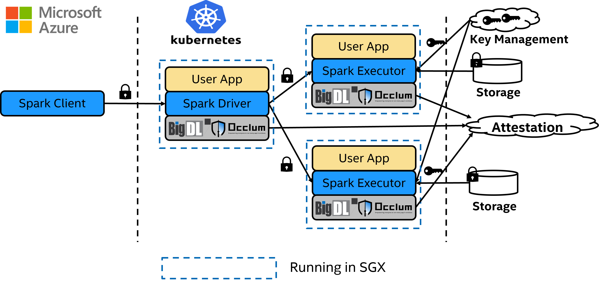

# BigDL-PPML-Azure-Occlum-Example

## Overview

This repository demonstrates how to run standard Apache Spark applications with BigDL PPML and Occlum on Azure Intel SGX enabled Confidential Virtual machines ([DCsv3](https://docs.microsoft.com/en-us/azure/virtual-machines/dcv3-series) or [Azure Kubernetes Service (AKS)](https://azure.microsoft.com/en-us/services/kubernetes-service/)). These Azure Virtual Machines include the Intel SGX extensions.

Key points:

* Azure DC Series: We run distributed Spark 3.1.2 examples, on an Azure DCsv3 machine running Docker. These machines are backed by the 3rd generation Intel Xeon Scalabe Processor with large Encrypted Page Cache (EPC) memory. 
* Occlum: To run Spark inside an Intel SGX enclave - we leverage Occlum, who have essentially taken the Open Source Spark code, and wrapped it with their enclave runtime so that Spark can run inside SGX enclaves (a task that requires deep knowledge of the SGX ecosystem - something Occlum is an expert at).



<p align="center"> </p>

* For Azure attestation details in Occlum init process please refer to [`maa_init`](https://github.com/occlum/occlum/tree/master/demos/remote_attestation/azure_attestation/maa_init).

## Prerequisites

* Set up Azure VM on Azure
    * [DCsv3](https://docs.microsoft.com/en-us/azure/virtual-machines/dcv3-series) for [single node spark example](#single-node-spark-examples-on-azure).
    * [Azure Kubernetes Service (AKS)](https://azure.microsoft.com/en-us/services/kubernetes-service/) for [distributed Spark examples](#distributed-spark-example-on-aks).
* Prepare image of Spark
* (Required for distributed Spark examples only) Download [Spark 3.1.2](https://archive.apache.org/dist/spark/spark-3.1.2/spark-3.1.2-bin-hadoop3.2.tgz) and extract Spark binary. Install OpenJDK-8, and `export SPARK_HOME=${Spark_Binary_dir}`.

Pull the image from [Dockerhub](https://hub.docker.com/r/intelanalytics/bigdl-ppml-azure-occlum).

```bash
docker pull intelanalytics/bigdl-ppml-azure-occlum:2.1.0
```

Or you can clone this repository and build image with `build-docker-image.sh`. Configure environment variables in `build-docker-image.sh`.

Build the docker image:

```bash
bash build-docker-image.sh
```

## Single Node Spark Examples on Azure

Single node Spark Examples require 1 Azure VM with SGX. All examples are running in SGX. You can apply it to your application with a few changes in dockerfile or scripts.

### SparkPi example

Run the SparkPi example with `run_spark_on_occlum_glibc.sh`.

```bash
docker run --rm -it \
    --name=azure-ppml-example-with-occlum \
    --device=/dev/sgx/enclave \
    --device=/dev/sgx/provision \
    intelanalytics/bigdl-ppml-azure-occlum:2.1.0 bash 

cd /opt
bash run_spark_on_occlum_glibc.sh pi
```

### Nytaxi example with Azure NYTaxi

Run the Nytaxi example with `run_azure_nytaxi.sh`.

```bash
docker run --rm -it \
    --name=azure-ppml-example-with-occlum \
    --device=/dev/sgx/enclave \
    --device=/dev/sgx/provision \
    intelanalytics/bigdl-ppml-azure-occlum:2.1.0 bash 

bash run_azure_nytaxi.sh
```

You should get Nytaxi dataframe count and aggregation duration when succeed.

## Distributed Spark Examples on AKS

### SparkPi on AKS

Configure environment variables in `run_spark_pi.sh`, `driver.yaml` and `executor.yaml`. Then you can submit SparkPi task with `run_spark_pi.sh`.

```bash
bash run_spark_pi.sh
```

### Nytaxi on AKS

Configure environment variables in `run_nytaxi_k8s.sh`, `driver.yaml` and `executor.yaml`. Then you can submit Nytaxi query task with `run_nytaxi_k8s.sh`.
```bash
bash run_nytaxi_k8s.sh
```

### Run TPC-H example
TPC-H queries are implemented using Spark DataFrames API running with BigDL PPML.

#### Generating tables

Go to [TPC Download](https://www.tpc.org/tpc_documents_current_versions/current_specifications5.asp) site, choose `TPC-H` source code, then download the TPC-H toolkits.
After you download the TPC-h tools zip and uncompressed the zip file. Go to `dbgen` directory and create a makefile based on `makefile.suite`, and run `make`.

This should generate an executable called `dbgen`.

```
./dbgen -h
```

`dbgen` gives you various options for generating the tables. The simplest case is running:

```
./dbgen
```
which generates tables with extension `.tbl` with scale 1 (default) for a total of rougly 1GB size across all tables. For different size tables you can use the `-s` option:
```
./dbgen -s 10
```
will generate roughly 10GB of input data.

#### Generate primary key and data key
Generate primary key and data key, then save to file system.

The example code for generating the primary key and data key is like below:
```
BIGDL_VERSION=2.1.0
java -cp /opt/bigdl-$BIGDL_VERSION/jars/*:/opt/spark/conf/:/opt/spark/jars/* \
   -Xmx10g \
   com.intel.analytics.bigdl.ppml.examples.GenerateKeys \
   --kmsType AzureKeyManagementService \
   --vaultName xxx \
   --primaryKeyPath xxx/keys/primaryKey \
   --dataKeyPath xxx/keys/dataKey
```
After generate keys on local fs, you may upload keys to Azure Data Lake store for running TPC-H with cluster mode.

The example script is like below:

```bash
az storage fs directory upload -f myFS --account-name myDataLakeAccount -s xxx/keys -d myDirectory/keys --recursive
```

#### Encrypt Data
Encrypt data with specified BigDL `AzureKeyManagementService`

The example code of encrypting data is like below:
```
BIGDL_VERSION=2.1.0
java -cp /opt/bigdl-$BIGDL_VERSION/jars/*:/opt/spark/conf/:/opt/spark/jars/* \
   -Xmx10g \
   com.intel.analytics.bigdl.ppml.examples.tpch.EncryptFiles \
   --kmsType AzureKeyManagementService \
   --vaultName xxx \
   --primaryKeyPath xxx/keys/primaryKey \
   --dataKeyPath xxx/keys/dataKey \
   --inputPath xxx/dbgen \
   --outputPath xxx/dbgen-encrypted
```

After encryption, you may upload encrypted data to Azure Data Lake store.

The example script is like below:

```bash
az storage fs directory upload -f myFS --account-name myDataLakeAccount -s xxx/dbgen-encrypted -d myDirectory --recursive
```

#### Running
Configure variable in run_tpch.sh to set Spark home, KeyVault, Azure Storage information, etc.
Make sure you set the INPUT_DIR and OUTPUT_DIR in `TpchQuery` class before compiling to point to the
location of the input data and where the output should be saved.
The example script to run a query is like:

```
BIGDL_VERSION=2.1.0
export SPARK_HOME=
SPARK_EXTRA_JAR_PATH=/bin/jars/bigdl-ppml-spark_3.1.2-${BIGDL_VERSION}.jar
SPARK_JOB_MAIN_CLASS=com.intel.analytics.bigdl.ppml.examples.tpch.TpchQuery
IMAGE=myContainerRegistry.azurecr.io/intel_corporation/bigdl-ppml-azure-occlum:latest

KEYVAULT_NAME=
DATA_LAKE_NAME=
DATA_LAKE_ACCESS_KEY=
FS_PATH=abfs://xxx@xxx.dfs.core.windows.net
INPUT_DIR=$FS_PATH/dbgen/dbgen-encrypted-1g
ENCRYPT_KEYS_PATH=$FS_PATH/keys
OUTPUT_DIR=$FS_PATH/dbgen/out-dbgen-1g

export kubernetes_master_url=

${SPARK_HOME}/bin/spark-submit \
    --master k8s://https://${kubernetes_master_url} \
    --deploy-mode cluster \
    --name spark-tpch \
    --conf spark.rpc.netty.dispatcher.numThreads=32 \
    --conf spark.kubernetes.container.image=${IMAGE} \
    --conf spark.kubernetes.authenticate.driver.serviceAccountName=spark \
    --conf spark.kubernetes.executor.deleteOnTermination=false \
    --conf spark.kubernetes.driver.podTemplateFile=./driver.yaml \
    --conf spark.kubernetes.executor.podTemplateFile=./executor.yaml \
    --conf spark.kubernetes.file.upload.path=file:///tmp \
    --conf spark.kubernetes.sgx.log.level=error \
    --conf spark.kubernetes.driverEnv.DRIVER_MEMORY=2g \
    --conf spark.kubernetes.driverEnv.SGX_MEM_SIZE="25GB" \
    --conf spark.kubernetes.driverEnv.META_SPACE=1024M \
    --conf spark.kubernetes.driverEnv.SGX_HEAP="1GB" \
    --conf spark.kubernetes.driverEnv.SGX_KERNEL_HEAP="2GB" \
    --conf spark.kubernetes.driverEnv.SGX_THREAD="1024" \
    --conf spark.kubernetes.driverEnv.FS_TYPE="hostfs" \
    --conf spark.executorEnv.SGX_MEM_SIZE="16GB" \
    --conf spark.executorEnv.SGX_KERNEL_HEAP="2GB" \
    --conf spark.executorEnv.SGX_HEAP="1GB" \
    --conf spark.executorEnv.SGX_THREAD="1024" \
    --conf spark.executorEnv.SGX_EXECUTOR_JVM_MEM_SIZE="7G" \
    --conf spark.kubernetes.driverEnv.SGX_DRIVER_JVM_MEM_SIZE="1G" \
    --conf spark.executorEnv.FS_TYPE="hostfs" \
    --num-executors 1  \
    --executor-cores 4 \
    --executor-memory 3g \
    --driver-cores 4 \
    --conf spark.cores.max=4 \
    --conf spark.driver.defaultJavaOptions="-Dlog4j.configuration=/opt/spark/conf/log4j2.xml" \
    --conf spark.executor.defaultJavaOptions="-Dlog4j.configuration=/opt/spark/conf/log4j2.xml" \
    --conf spark.network.timeout=10000000 \
    --conf spark.executor.heartbeatInterval=10000000 \
    --conf spark.python.use.daemon=false \
    --conf spark.python.worker.reuse=false \
    --conf spark.sql.auto.repartition=true \
    --conf spark.default.parallelism=400 \
    --conf spark.sql.shuffle.partitions=400 \
    --conf spark.hadoop.fs.azure.account.auth.type.${DATA_LAKE_NAME}.dfs.core.windows.net=SharedKey \
    --conf spark.hadoop.fs.azure.account.key.${DATA_LAKE_NAME}.dfs.core.windows.net=${DATA_LAKE_ACCESS_KEY} \
    --conf spark.hadoop.fs.azure.enable.append.support=true \
    --conf spark.bigdl.kms.type=AzureKeyManagementService \
    --conf spark.bigdl.kms.azure.vault=$KEYVAULT_NAME \
    --conf spark.bigdl.kms.key.primary=$ENCRYPT_KEYS_PATH/primaryKey \
    --conf spark.bigdl.kms.key.data=$ENCRYPT_KEYS_PATH/dataKey \
    --class $SPARK_JOB_MAIN_CLASS \
    --verbose \
    local:$SPARK_EXTRA_JAR_PATH \
    $INPUT_DIR \
    $OUTPUT_DIR \
    AES/CBC/PKCS5Padding \
    plain_text [QUERY]
```
INPUT_DIR is the TPC-H's data dir.
OUTPUT_DIR is the dir to write the query result.
The optional parameter [QUERY] is the number of the query to run e.g 1, 2, ..., 22
## Known issues

1. If you meet the following error when running the docker image:

```bash
aesm_service[10]: Failed to set logging callback for the quote provider library.
aesm_service[10]: The server sock is 0x5624fe742330
```

This may be associated with [SGX DCAP](https://github.com/intel/linux-sgx/issues/812). And it's expected error message if not all interfaces in quote provider library are valid, and will not cause a failure.

2. If you meet the following error when running MAA example:

```bash
[get_platform_quote_cert_data ../qe_logic.cpp:352] p_sgx_get_quote_config returned NULL for p_pck_cert_config.
thread 'main' panicked at 'IOCTRL IOCTL_GET_DCAP_QUOTE_SIZE failed', /opt/src/occlum/tools/toolchains/dcap_lib/src/occlum_dcap.rs:70:13
note: run with `RUST_BACKTRACE=1` environment variable to display a backtrace
[ERROR] occlum-pal: The init process exit with code: 101 (line 62, file src/pal_api.c)
[ERROR] occlum-pal: Failed to run the init process: EINVAL (line 150, file src/pal_api.c)
[ERROR] occlum-pal: Failed to do ECall: occlum_ecall_broadcast_interrupts with error code 0x2002: Invalid enclave identification. (line 26, file src/pal_interrupt_thread.c)
/opt/occlum/build/bin/occlum: line 337:  3004 Segmentation fault      (core dumped) RUST_BACKTRACE=1 "$instance_dir/build/bin/occlum-run" "$@"
```

This may be associated with [[RFC] IOCTRL IOCTL_GET_DCAP_QUOTE_SIZE failed](https://github.com/occlum/occlum/issues/899).

## Reference

1. https://www.intel.com/content/www/us/en/developer/tools/software-guard-extensions/overview.html
2. https://github.com/intel-analytics/BigDL
3. https://github.com/occlum/occlum
4. [Confidential Data Analytics with Apache Spark on Intel SGX Confidential Containers](https://github.com/Azure-Samples/confidential-container-samples/blob/main/confidential-big-data-spark/README.md)
